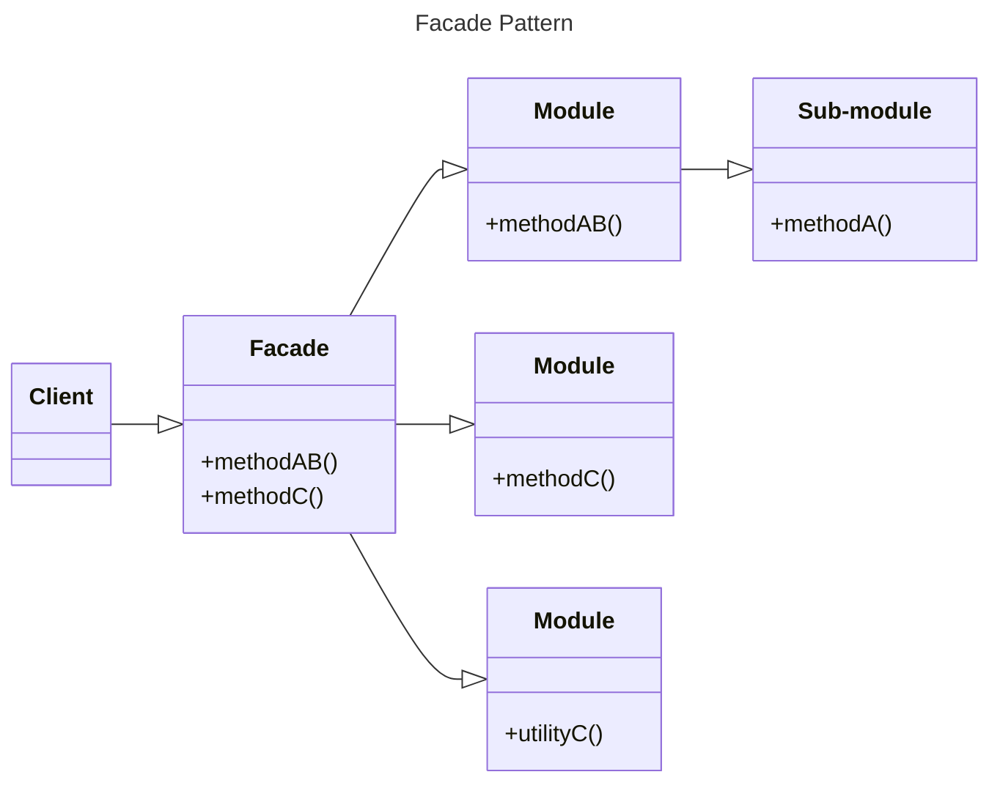

The word facade quite literally means 
> *"The outward appearance that is maintained to conceal a less pleasant or incredible reality"*.

Now applying this to my previous knowledge of Facade classes in Laravel, I know understand why I was so frustrated when I would see a Facade being used and step into the Facade class to learn more about the method being used only not find what I was looking for.

Facades provide a level of abstraction that simplifies the interworking of complex classes. Sort of like a grey box in a way where we can see the methods that a facade can preform but not the entire picture, which isn't always helpful to the user.

The Facade pattern can be combined with other patterns such as the module pattern to define a module with many fields and methods and then using a facade to then simplify the fields and methods to be used by the user.
```js
const _private = {
	i: 5,
	get() {
		console.log(`current value:${this.i}`);
	},
	set(val) {
		this.i = val;
	},
	run() {
		console.log('running');
	},
	jump() {
		console.log('jumping');
	},
};
	// We used the destructuring assignment syntax that makes it possible to unpack values from data structures into distinct variables.
const module = {
	facade({ val, run }) {
		_private.set(val);
		_private.get();
		if (run) {
			_private.run();
		}
	},
};
export default module;

import module from './module.js';

// Outputs: "current value: 10" and "running"
module.facade({
	run: true,
	val: 10,
});
```
## Notes on Abstraction
There a few disadvantages to the Facade pattern, one in particular is the low performance. One example is jQuery's `$("#identifier")` vs the javascript native `getElementById("identifier")`. The latter is significantly more performant, because jQuery does a lot behind the scenes in order to return a jQuery object not just the DOM object. So be aware of the performance cost when using the Facade pattern.
