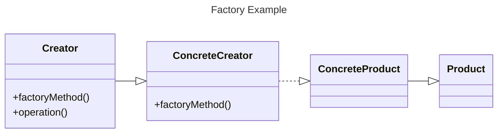

#### Factory
This is another pattern for creating objects, yet it doesn't require the use of a constructor. You just need a generic interface where we can specify the type of factory object we want to create.

##### When To Use The Factory Pattern
- When our object or component setup is highly complex
- When we need a convenient way to generate different instances of objects depending on the environment
- When working with small objects or components that share the same properties
- When composing objects with instances of other objects that need only to satisfy an API contract (aka, duck typing). This is useful for decoupling
##### When Not To Use the Factory Pattern
Unless introducing an interface for object creation is a design goal for the library or framework, stick to explicit constructors to avoid overhead
