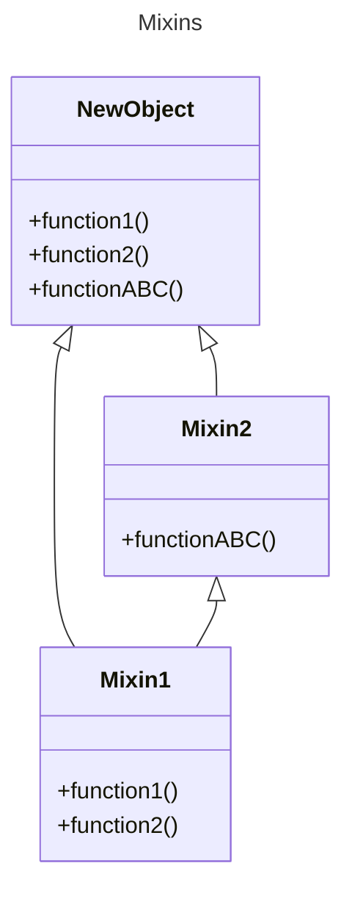

In traditional programming languages like C++ or Lisp, Mixins are classes that offer functionality that a sub-class or a group of sub-classes can inherit for function re-use.

I've previously come across the pattern from my days coding with Vue.js. Mixins were a concept introduced for the purpose of reusing Vue functionality across components. This is no longer widely used after the release of Vue 3 and the Composition API.

## Subclassing
Thanks to ES2015+ we are able to extend base or superclasses. The child class being extended is called the sub-class.
```js
class Person {
	constructor(firstName, lastName) {
		this.firstName = firstName;
		this.lastName = lastName;
		this.gender = "male";
	}
}

const clark = new Person("Clark", "Kent");

// Sub-class
class Superhero extends Person {
	constructor(firstName, lastName, powers) {
		super(firstName, lastName);
		this.powers = powers;
	}
}

const superman = new Superhero("Clark", "Kent", ["flying", "heat-vision"]);
```

## Advantages & Disadvantages
The advantage of mixins is the decrease in duplicated code and easily importing functionality across your system.

The disadvantages are that some developers believe that injecting functionality into a class or object prototype is bad as it leads to prototype pollution and a level of uncertainty regarding the order of our functions

Much like Vue.js, React discourages the use of mixins since ES6 classes were introduced and recommends using HOC (high order components) and hooks to share functionality across components
